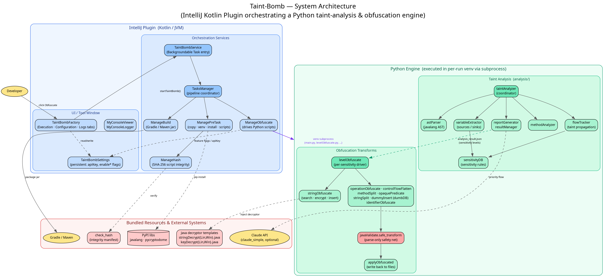
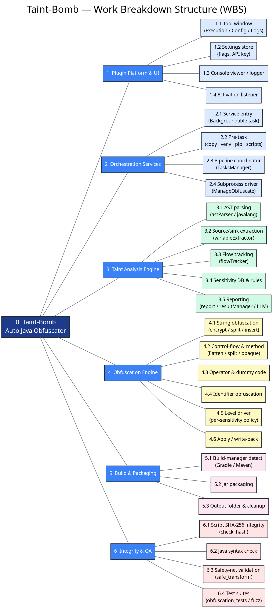
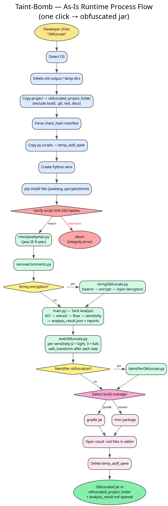
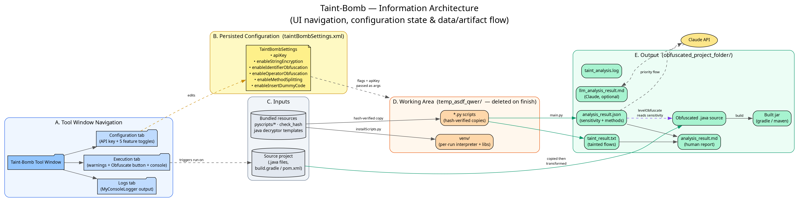

# Taint Bomb 자동 자바 난독화 도구 by JoJoonBalSsa!

---

####

  
  
  

  <a href="https://plugins.jetbrains.com/plugin/25629-taint-bomb-auto-java-obfuscator">
    

  </a>

Taint Bomb은 IntelliJ에서 작동하는 원클릭 자동 자바 난독화 플러그인입니다. 가볍지만 강력한 난독화 기능을 지원하며, Taint 분석을 통해 코드의 민감도를 식별하고 그 결과에 기반한 차등적 난독화를 수행합니다.
버그나 기능 추가를 원하신다면 [이슈](https://github.com/JoJoonBalSsa/Taint-Bomb/issues)를 남겨주세요.

  <a href="./README.md">
    
🇺🇸 English

  </a>

# 아키텍처 & 설계

아래 다이어그램은 [`docs/diagrams`](./docs/diagrams)의 소스로부터 생성됩니다 (Graphviz `.dot` 소스가 각 이미지와 함께 보관되어 있으며, `dot -Tpng -Gdpi=150 docs/diagrams/<name>.dot -o docs/diagrams/<name>.png`로 재생성합니다).

## 시스템 아키텍처

이 플러그인은 Kotlin/IntelliJ 프런트엔드가 Python 기반 Taint 분석 & 난독화 엔진을 실행별 가상환경에서 오케스트레이션하는 구조입니다.

## 작업 분해 구조 (WBS)

## As-Is 런타임 처리 흐름

**Obfuscate** 버튼 클릭 한 번으로 실제 실행되는 순서입니다. SHA-256 스크립트 무결성 검증과 민감도별 난독화 단계를 포함합니다.

## 정보 아키텍처

툴 윈도우 내비게이션, 저장되는 설정, 그리고 입력 프로젝트에서 생성되는 `obfuscated_project_folder/`까지의 데이터/산출물 흐름입니다.

# 요구 사항

## 플러그인

- 인터넷 연결
  - Python 의존성 설치 시 필요합니다.
- Python 3.7 이상
- IntelliJ 2023.3 이상
- Windows, macOS, Linux 지원

## 대상 프로젝트

- Java SE 8 문법
  - 공식 문서 참고 - <http://docs.oracle.com/javase/specs/jls/se8/html/>

- gradle(8 이상) 또는 maven(3.9 이상)
  - gradle 사용 시 build.gradle에 jar 속성이 정의되어 있어야 합니다.
- 사용법 - 주의사항 참고

# 사용 방법

1. IntelliJ에 플러그인을 설치합니다.
  - [GitHub Releases](https://github.com/JoJoonBalSsa/Taint-Bomb/releases) 또는 [IntelliJ 마켓플레이스](https://plugins.jetbrains.com/plugin/25629-taint-bomb-auto-java-obfuscator)에서 설치
2. 난독화할 대상 프로젝트를 IntelliJ에서 열고, Taint Bomb 창을 엽니다.
3. Configuration 탭에서 난독화 방식과 AI API 키(선택)를 설정합니다.
4. Obfuscate 버튼을 클릭합니다.
5. 프로젝트 파일에 'obfuscated_project_folder'가 생성됩니다. 난독화된 프로젝트 코드와 빌드된 jar 파일, 그리고 Taint 분석 결과(taint_analysis.txt & analysis_result.md)와 Claude AI 분석 결과가 포함됩니다. `analysis_result.md` 끝에는 소스에서 발견된 취약 코드 패턴을 나열하는 **Static Weakness Scan** 섹션도 포함됩니다.

## 난독화 기법

Taint Bomb은 **차등 난독화(differential obfuscation)**를 수행합니다. Taint 분석이 민감하다고 표시한 코드 영역에만 더 강한 변환을 적용하고, 민감도가 낮은 코드는 성능과 안정성을 위해 그대로 둡니다.

| 민감도 | 적용되는 변환 |
| --- | --- |
| Level 1 (낮음) | 건너뜀 |
| Level 2 (중간) | 연산자 난독화, 불투명 술어 삽입, 문자열 분할 인코딩 |
| Level 3 (높음) | 연산자 난독화, 제어 흐름 평탄화, 메소드 분할, 불투명 술어 삽입, 문자열 분할 인코딩, 더미 코드 삽입 |

프로젝트 전역 변환(민감도와 무관하게 적용): 주석 제거, 문자열 암호화, 식별자 난독화.

이번 릴리스 신규 사항:

- **제어 흐름 평탄화** – 직선적인 메소드 본문을 무작위화된 디스패처 `switch`-루프로 재작성합니다.
- **불투명 술어 삽입** – 컴파일러가 접을 수 없는 항상-거짓 술어로 정크 블록을 감쌉니다(추가 import 불필요).
- **문자열 분할 인코딩** – 문자열 리터럴을 런타임에 조립되는 문자열별 XOR 인코딩 char 배열로 대체하여, 소스에 평문 문자열이 남지 않게 합니다.
- **문법 검증 안전망** – 모든 변환은 적용 전 재파싱됩니다. 잘못된 Java를 생성하는 단계는 마지막 유효 버전으로 자동 되돌려지며, 실패한 변환이 전체 실행을 중단시키지 않습니다.
- **정적 취약점 스캔** – 분석 대상 소스에 대한 보안 코드 리뷰로, 안전하지 않은 역직렬화, 허용적인 TLS/호스트명 검증, SQL 주입 표면, 하드코딩된 비밀값, 민감정보 로깅을 표시합니다. 결과는 `analysis_result.md`에 표로 추가됩니다. 단독 실행도 가능합니다: `python findJavaWeak.py <path>`.

> 리플렉션 기반 호출 우회도 실험적 옵트인 모듈로 번들되어 있습니다. 문법 검증만으로는 런타임 의미를 보장할 수 없어 기본 파이프라인에서는 제외됩니다.

> 정적 취약점 스캔은 `obfuscated_project_folder`의 분석 사본을 대상으로 실행됩니다. 문자열 암호화나 주석 제거(기본값)가 켜져 있으면 리터럴 기반 발견(예: 하드코딩된 비밀값)이 줄어들 수 있습니다. 완전한 커버리지를 위해서는 원본 소스에 대해 `findJavaWeak.py`를 실행하세요.

## 주의사항

- 오버라이딩하는 모든 메소드에 @Override 어노테이션이 있는지 확인하세요.
- 대상 프로젝트에 테스트 코드가 포함된 경우, 제대로 난독화되지 않을 수 있습니다.
- Taint 분석 결과에 민감도 2 또는 3 레벨이 없으면 일부 난독화 동작(연산자 난독화, 메소드 분할, 더미 코드 삽입)은 건너뜁니다.
